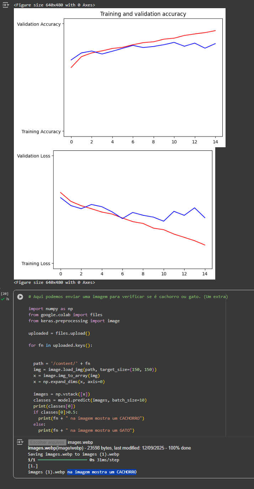

# 🐱🐶 Classificação de Imagens - Cats vs Dogs (Transfer Learning)

Este projeto aplica **Deep Learning** com **Transfer Learning** para classificar imagens de gatos e cachorros utilizando a base de dados [Cats vs Dogs](https://www.microsoft.com/en-us/download/details.aspx?id=54765).

## 🚀 Objetivo
- Treinar um modelo de classificação binária.
- Aplicar técnicas de **transfer learning** para melhorar a performance.
- Avaliar métricas como **accuracy** e **loss** no treinamento e validação.

## 🧩 Tecnologias utilizadas
- Python 3.x  
- Google Colab  
- TensorFlow / Keras  

## 📊 Resultados
Durante o treinamento, o modelo atinge uma boa acurácia de validação, evitando overfitting.

### 🔹 Gráfico da Acurácia




### 🔹 Exemplo de previsão
Após o treinamento, o modelo é capaz de prever corretamente se a imagem é de um **gato** ou um **cachorro**.

```python
# Exemplo de uso:
import tensorflow as tf
import numpy as np
from tensorflow.keras.preprocessing import image

img = image.load_img("meu_teste.jpg", target_size=(160, 160))
x = image.img_to_array(img)
x = np.expand_dims(x, axis=0)

pred = model.predict(x)
print("Dog" if pred[0] > 0.5 else "Cat")
```

## 📂 Estrutura do Projeto
```
📦 cats-vs-dogs
 ┣ 📂 imagens/            # coloque aqui gráficos como accuracy.png e loss.png
 ┣ 📜 cats_vs_dogs.ipynb  # notebook principal
 ┣ 📜 cats_vs_dogs.py  # py principal
 ┣ 📜 README.md           # documentação do projeto
 ┗ 📜 requirements.txt    # dependências (opcional)
```

## 📝 Como executar
1. Abra o projeto no [Google Colab](https://colab.research.google.com/).  
2. Execute todas as células para baixar os dados, treinar o modelo e avaliar.  
3. No final, salve o modelo com:
   ```python
   model.save("cats_vs_dogs_model.keras")
   ```
4. Use o modelo salvo para previsões em imagens novas.

---