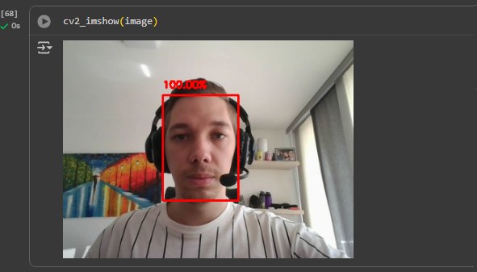

# 🧑‍💻 Desafio 5 – Sistema de Reconhecimento Facial do Zero  

## 📌 Objetivo  
Este projeto tem como finalidade **desenvolver um sistema de detecção e reconhecimento facial** utilizando **TensorFlow** e bibliotecas auxiliares estudadas ao longo do curso.  

O sistema deve ser capaz de:  

- Detectar múltiplas faces em tempo real ou em imagens.  
- Classificar cada face detectada de acordo com o modelo treinado.  

---

## 🎥 Demonstração em Tempo Real

O modelo de **Reconhecimento Facial** foi implementado utilizando a **webcam em tempo real**, permitindo detectar e reconhecer rostos instantaneamente.

---

### Resultado
Abaixo, um exemplo do sistema detectando meu rosto com **100% de confiança**:



---

## 🔧 Tecnologias Utilizadas  

- [TensorFlow](https://www.tensorflow.org/)  
- OpenCV  
- NumPy  
- Matplotlib  
- Outras bibliotecas auxiliares conforme necessidade do projeto  

---

## 📂 Estrutura do Projeto  

```
.
├── README.md              # Documentação do projeto
├── modelo/                # Pasta contendo o modelo treinado
│   ├── detector/          # Rede de detecção de faces
│   ├── classificador/     # Rede de classificação de faces
└── DetectarFace.ipynb             # Notebook principal com execução do sistema
```

---

## 🚀 Como Executar  

1. Clone este repositório:  

```
git clone https://github.com/seuusuario/desafio5-reconhecimento-facial.git
cd desafio5-reconhecimento-facial
```

2. Instale as dependências:  

```
pip install -r requirements.txt
```

3. Execute o notebook principal:  

```
jupyter notebook main.ipynb
```

---

## 📖 Referências  

- [Detecção Facial (Colab)](https://colab.research.google.com/drive/1QnC7lV7oVFk5OZCm75fqbLAfD9qBy9bw?usp=sharing)  
- [Detecção e Classificação de Objetos (Colab)](https://colab.research.google.com/drive/1xdjyBiY75MAVRSjgmiqI7pbRLn58VrbE?usp=sharing)  
- Slides utilizados no módulo (disponíveis na plataforma do curso)  

---